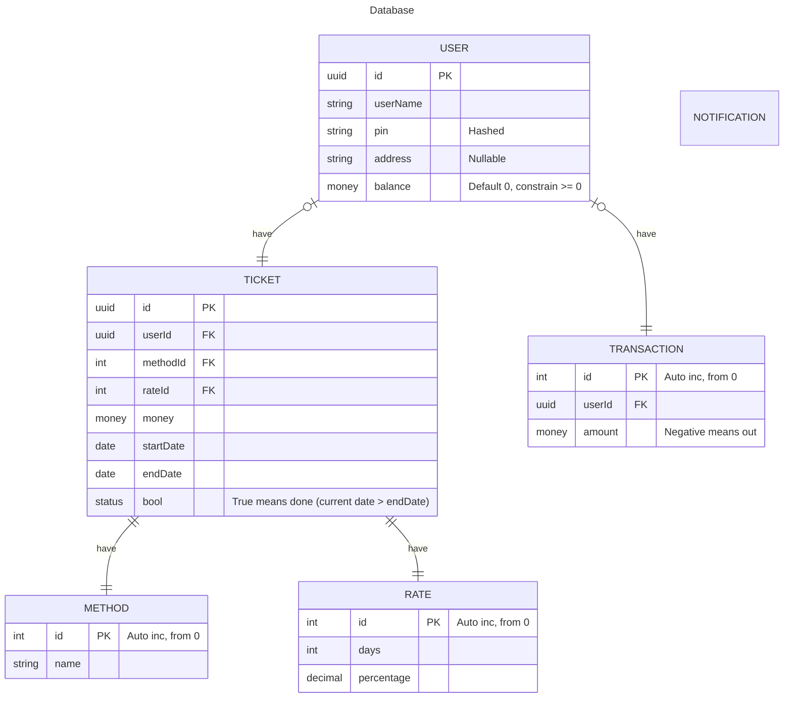

### DB

```mermaid
---
title: Database
---
erDiagram
  USER {
    uuid id PK
    string userName
    string pin "Hashed"
    string address "Nullable"
    money balance "Default 0, constrain >= 0"
  }

  METHOD {
    int id PK "Auto inc, from 0"
    string name
  }

  RATE {
    int id PK "Auto inc, from 0"
    int days
    decimal percentage
  }

  TICKET {
    uuid id PK
    uuid userId FK
    int methodId FK
    int rateId FK
    money money
    date startDate
    date endDate
    status bool "True means done (current date > endDate)"
  }

  TRANSACTION {
    int id PK "Auto inc, from 0"
    uuid userId FK
    money amount "Negative means out"
  }

  NOTIFICATION {

  }

  USER |o--|| TICKET : have
  TICKET ||--|| METHOD : have
  TICKET ||--|| RATE : have
  USER |o--|| TRANSACTION : have
```
