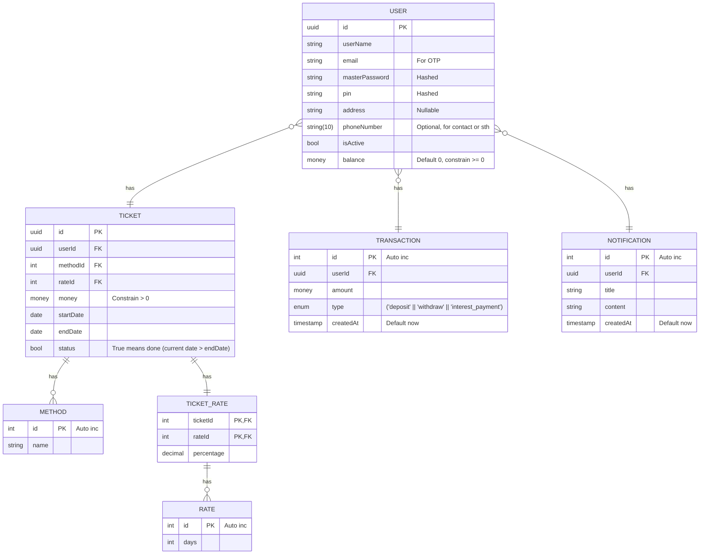

## ToC

<!-- START doctoc generated TOC please keep comment here to allow auto update -->
<!-- DON'T EDIT THIS SECTION, INSTEAD RE-RUN doctoc TO UPDATE -->

- [DB](#db)
- [Architect](#architect)

<!-- END doctoc generated TOC please keep comment here to allow auto update -->

---

### DB

### Architect

