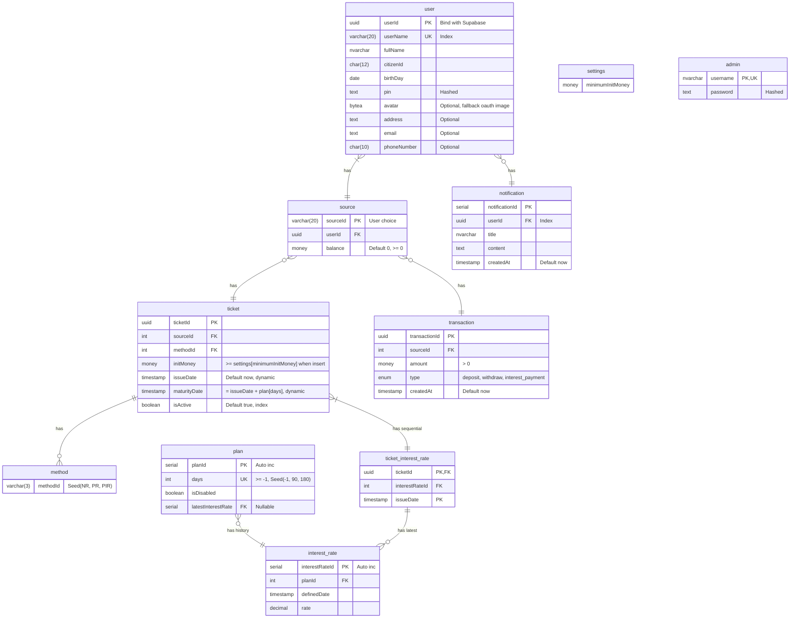

## ToC

<!-- START doctoc generated TOC please keep comment here to allow auto update -->
<!-- DON'T EDIT THIS SECTION, INSTEAD RE-RUN doctoc TO UPDATE -->

- [DB](#db)
- [Architect](#architect)

<!-- END doctoc generated TOC please keep comment here to allow auto update -->

---

### DB

> [!WARNING]
>
> - UUID or serial? if delete, that empty slot is skipped

> [!NOTE]
>
> - `user[phoneNumber]`, `user[email]` are optional (for contact)

Backend:

- Ticket:
  - Return `paidInterest` = `initMoney` \* `interest_rate[rate]` / 100"
  - Return `anticipatedInterest` is when instantly settle (latest `interest_rate[rate]` where `plan[days=-1]`)

### Architect

